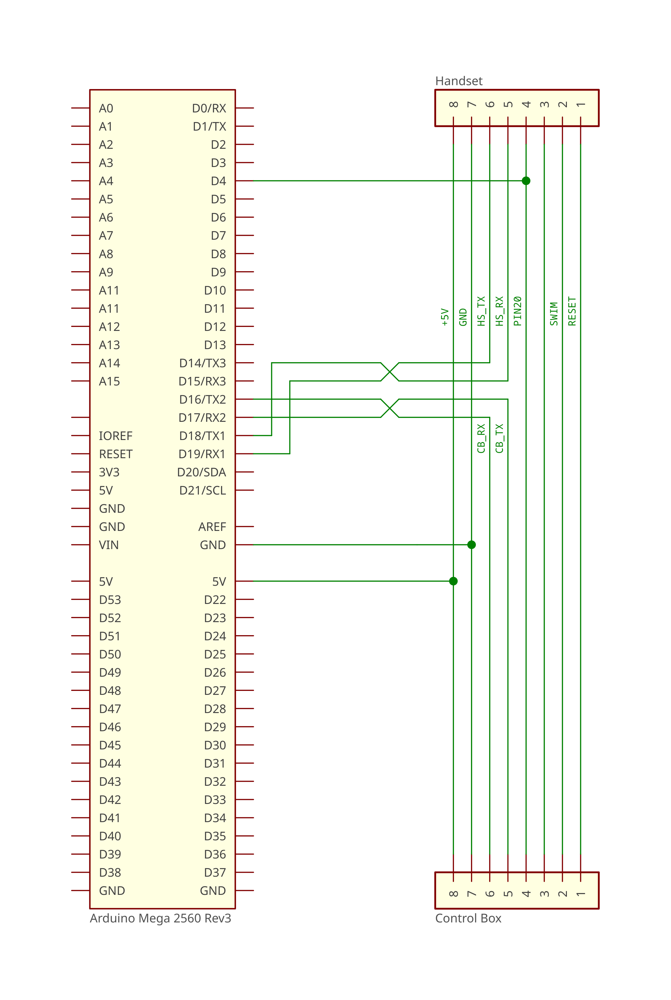

# LoctekMotion Desk (FlexiSpot)

I purchased new desk from FlexiSpot recently and was happy to discover there were some projects for integrating the controls with HomeAssistant. However, my control box only has a single RJ45 port for the hand set. I didn't want to give up manual control of the desk and rely solely on control over the network, so I wrote an Arduino program to sit between the handset and control box. This repository documents my progress.

- Desk: `EC5B-CA`
  - `EC5` = Model
  - `B` = Black / `W` = White / `S` = Grey
  - `CA` = Canada?
  - Specs:
    - Colour: Black
    - Height: `25.4` - `51.0` (`24.4` - `50.0` is printed in the manual)
    - Power supply: 29 VDC, 1.8 A (52.2 W)
- Control Box: `CB38M2H(PB)-2`
  - `CB` = Control Box
  - `38` = ??
  - `M` = ??
  - `2` = ??
  - `H` = ??
  - `(PB)` = ??
  - `-2` = ??
  - Specs:
    - Input: 18-33VDC, 10A
    - Output M1/M2: maximum 33VDC, maximum 4A
    - Output DC: maximum 1.1A
    - Duty cycle: 2 min on, 18 min off
    - Ports:
      - DC in
      - RJ45 - handset control
      - M1, M2 - motors
      - 2x DC out - handset USB
- Hand Set: `HS11B-1`
  - `HS` = Hand set
  - `11` = ??
  - `B` = USB port
  - `-1` = ??
  - Specs:
    - Digital display
    - Up/Down buttons
    - 3 presets
    - Time reminder
    - USB charging port

## Parts

- Arduino Mega - (for the multiple hardware serial ports)
- RJ45 QuickPort/Keystone
- RJ45 connector
- Wire (I had some Cat6 cable lying around)

## Wiring



[Schematic (PDF)](docs/images/basic.pdf)


I am terminating the RJ45 port/connectors according to the T568B standard.

| Hand Set |           | RJ45   | Arduino | Arduino | RJ45   | Control Box |
| -------- | --------- | ------ | ------- | ------- | ------ | ----------- |
| RESET    | 🟤 Brown  | 🟠⚪ 1 | —       | —       | 🟠⚪ 1 | RESET       |
| SWIM     | ⚪ White  | 🟠🟠 2 | —       | —       | 🟠🟠 2 | SWIM        |
| empty    | 🟣 Purple | 🟢⚪ 3 | —       | —       | 🟢⚪ 3 | empty       |
| PIN 20   | 🔴 Red    | 🔵🔵 4 | 4       | 4       | 🔵🔵 4 | PIN 20      |
| RX       | 🟢 Green  | 🔵⚪ 5 | TX1     | RX2     | 🔵⚪ 5 | TX          |
| TX       | ⚫ Black  | 🟢🟢 6 | RX1     | TX2     | 🟢🟢 6 | RX          |
| GND      | 🔵 Blue   | 🟤⚪ 7 | GND     | GND     | 🟤⚪ 7 | GND         |
| +5V      | 🟡 Yellow | 🟤🟤 8 | +5V     | +5V     | 🟤🟤 8 | +5V         |

## 7-segment display

> <https://alselectro.wordpress.com/2015/03/03/8051-tutorials-3-interfacing-7-segment-display/>

```
     ╱‾‾‾‾‾╲
    |   A   |
 ╱‾╲ ╲_____╱ ╱‾╲
|   |       |   |
| F |       | B |
|   |       |   |
 ╲_╱ ╱‾‾‾‾‾╲ ╲_╱
    |   G   |
 ╱‾╲ ╲_____╱ ╱‾╲
|   |       |   |
| E |       | C |
|   |       |   |
 ╲_╱ ╱‾‾‾‾‾╲ ╲_╱
    |   D   |
     ╲_____╱  [.]
```

| [.] | G   | F   | E   | D   | C   | B   | A   | value  | character |
| --- | --- | --- | --- | --- | --- | --- | --- | ------ | --------- |
| `0` | `0` | `0` | `0` | `0` | `0` | `0` | `0` | `0x00` | (blank)   |
| `0` | `0` | `1` | `1` | `1` | `1` | `1` | `1` | `0x3F` | 🯰         |
| `0` | `0` | `0` | `0` | `0` | `1` | `1` | `0` | `0x06` | 🯱         |
| `0` | `1` | `0` | `1` | `1` | `1` | `1` | `1` | `0x5B` | 🯲         |
| `0` | `1` | `0` | `0` | `1` | `1` | `1` | `1` | `0x4F` | 🯳         |
| `0` | `1` | `1` | `0` | `0` | `1` | `1` | `0` | `0x66` | 🯴         |
| `0` | `1` | `1` | `0` | `1` | `1` | `0` | `1` | `0x6D` | 🯵         |
| `0` | `1` | `1` | `1` | `1` | `1` | `0` | `0` | `0x7C` | 🯶         |
| `0` | `0` | `0` | `0` | `0` | `1` | `1` | `1` | `0x07` | 🯷         |
| `0` | `1` | `1` | `1` | `1` | `1` | `1` | `1` | `0x7F` | 🯸         |
| `0` | `1` | `1` | `0` | `1` | `1` | `1` | `1` | `0x6F` | 🯹         |
| `0` | `0` | `0` | `0` | `1` | `0` | `0` | `1` | `0x09` | `🮀`       |
| `0` | `0` | `1` | `1` | `0` | `0` | `0` | `1` | `0x31` | `R`       |
| `0` | `1` | `0` | `0` | `0` | `0` | `0` | `0` | `0x40` | `-`       |
| `0` | `1` | `0` | `1` | `0` | `0` | `0` | `0` | `0x50` | `r`       |
| `0` | `1` | `0` | `1` | `1` | `1` | `0` | `0` | `0x5C` | `o`       |
| `0` | `1` | `0` | `1` | `0` | `1` | `0` | `0` | `0x54` | `n`       |
| `0` | `1` | `1` | `1` | `0` | `0` | `0` | `1` | `0x71` | `F`       |
| `0` | `1` | `1` | `1` | `0` | `1` | `1` | `1` | `0x77` | `A`       |
| `0` | `1` | `1` | `1` | `1` | `0` | `0` | `0` | `0x78` | `t`       |
| `0` | `1` | `1` | `1` | `1` | `0` | `0` | `1` | `0x79` | `E`       |
| `1` | `0` | `0` | `0` | `0` | `0` | `0` | `0` | `0x80` | `.`       |

### Height

The height of the desk is transmitted as a series of bytes (see table) that tell the display which segments of the three 7-segment modules to turn on.

**Example**

The bytes `66 FD 3F` would display `46.0`.

- 4th byte `0x66` = `4`
- 5th byte `0xFD` = `6.`
  - `0x7d` = `6`
  - `0x80` = `.`
- 6th byte `0x3F` = `0`

### Reminder alarm

During setup/countdown: `0x09` (top and bottom segments), and values corresponding to digits 00-99

**on**

`0x00` `0x5C` `0x54`

Send command `0x14` to activate alarm sound.

**oFF**

`0x5C` `0x71` `0x71`

Send command `0x15` to deactivate alarm sound.

### Other Messages

**A-1** / **A-2** / **A-3**

- `0x77` `0x40` `0x06` (A-1)
- `0x77` `0x40` `0x5B` (A-2)
- `0x77` `0x40` `0x4F` (A-3)

Anti-collision sensitivity. (0=off; 1 = low; 2 = medium; 3 = high)

Press `▲` and `▼` at the same time to adjust.

**S-1** / **S-2** / **S-3**

- `0x6D` `0x40` `0x06` (S-1)
- `0x6D` `0x40` `0x5B` (S-2)
- `0x6D` `0x40` `0x4F` (S-3)

Saved height setting.

Set height, press `M`, then press `1`, `2`, or `3` to save.

**E01** / **E02**

- `0x79` `0x3F` `0x06` (E01)
- `0x79` `0x3F` `0x5B` (E02)

Problem with the motors. This could be due to overheating, collision, etc.

- E22 - When motor 2 is unplugged before operating.
- E23 - When motor 1 in unplugged before operating.

**rSt** / **ASr**

- `0x50` `0x6d` `0x78` (rSt) - actually displayed
- `0x77` `0x6d` `0x50` (ASr) - instruction manual

Resolution: Hold the down button until desk rebounds and display returns to normal.

> I triggered this message accidentally by pulling PIN20 low while the desk was moving.
>
> Example:
>
> 1.  Set a preset while the desk is in a low position.
> 2.  Raise the desk a few inches.
> 3.  Using Arduino code, pull PIN20 high.
> 4.  Send the command to trigger the preset
> 5.  Before the desk stops, pull PIN20 low.

## Protocol

| Begin  | Length | Type | Payload | CRC16 (modbus) | End    |
| ------ | ------ | ---- | ------- | -------------- | ------ |
| `0x9B` | u8     | u8   | u8...   | u16            | `0x9D` |

Packets:

- begin with `0x9B`
- length is number of bytes between `0x9B` and `0x9D` (exclusive).
- type
- payload
- CRC16 (modbus), calculated using `length` + `type` + `payload`
- end with `0x9D`

### Hand set (HS)

These packets are received from the hand set.

#### `0x02` - State

| Begin  | Length | Type   | Payload | CRC16 (modbus) | End    |
| ------ | ------ | ------ | ------- | -------------- | ------ |
| `0x9B` | `0x06` | `0x02` | u16     | `0x` `0x`      | `0x9D` |

**HS** sends this about every 40ms (25 Hz).

| Value    | Button         |
| -------- | -------------- |
| `0x0000` | None           |
| `0x0100` | `▲` - Raise    |
| `0x0200` | `▼` - Lower    |
| `0x0400` | `1` - Preset 1 |
| `0x0800` | `2` - Preset 2 |
| `0x1000` | `3` - Preset 3 |
|          | `4` - Preset 4 |
| `0x2000` | `M` - Save     |
| `0x4000` | `A` - Remind   |

> The `0x0000` value can be used to tell the **CB** that the **HS** is "active". Useful to obtain the height of the desk.

These values can be added together to indicate multiple buttons pressed at the same time.
E.G. `0x0100` & `0x0200` = `▲` and `▼` at the same time.

### Control Box (CB)

These packets are received from the control box.

#### `0x11` - Unknown

| Begin  | Length | Type   | CRC16 (modbus) | End    |
| ------ | ------ | ------ | -------------- | ------ |
| `0x9B` | `0x07` | `0x11` | `0x7C` `0xC3`  | `0x9D` |

**CB** sends this about every 40 ms (25 Hz).

Not sure what this means. Could be a heartbeat signal?

#### `0x12` - Display

| Begin  | Length | Type   | Payload                         | CRC16 (modbus) | End    |
| ------ | ------ | ------ | ------------------------------- | -------------- | ------ |
| `0x9B` | `0x07` | `0x12` | u8, u8, u8 (tens, ones, tenths) | `0x??` `0x??`  | `0x9D` |

**CB** sends this about every 60 ms (16.66 Hz).

> When all three bytes are `0x00`, display is off.

#### `0x14` - Beep On

| Begin  | Length | Type   | CRC16 (modbus) | End    |
| ------ | ------ | ------ | -------------- | ------ |
| `0x9B` | `0x07` | `0x14` | `0x7F` `0x03`  | `0x9D` |

**CB** sends this about every XX ms (XX Hz).

Causes HS to start beeping.

#### `0x15` - Beep Off

| Begin  | Length | Type   | CRC16 (modbus) | End    |
| ------ | ------ | ------ | -------------- | ------ |
| `0x9B` | `0x07` | `0x15` | `0xBF` `0xC2`  | `0x9D` |

**CB** sends this about every 8 ms (125 Hz).

If `0x14` was sent previously, this causes HS to stop beeping.

## Credits

- [iMicknl/LoctekMotion_IoT](https://github.com/iMicknl/LoctekMotion_IoT) - Wiring and initial Arduino code.
- [notiflux/arduinoSerialTap](https://github.com/notiflux/arduinoSerialTap) - Arduino code for UART/serial tap.
